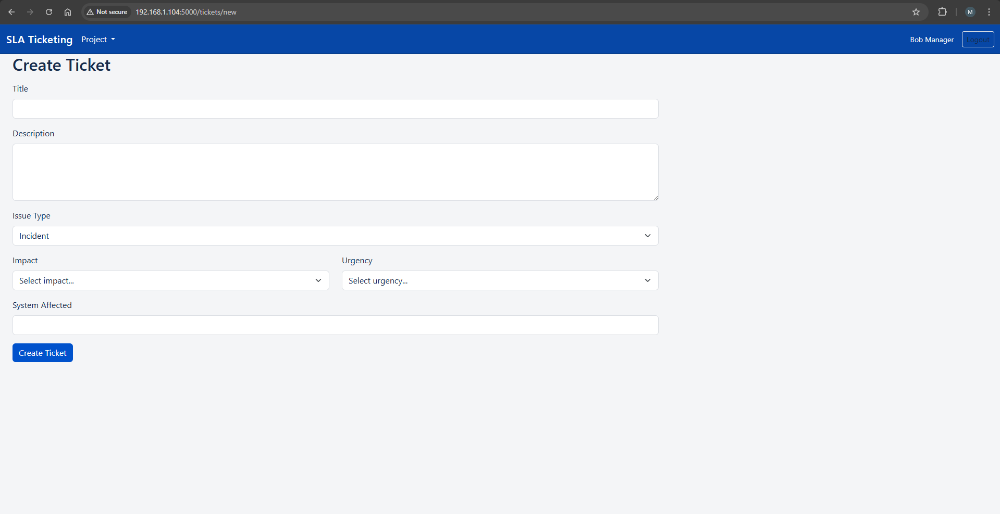
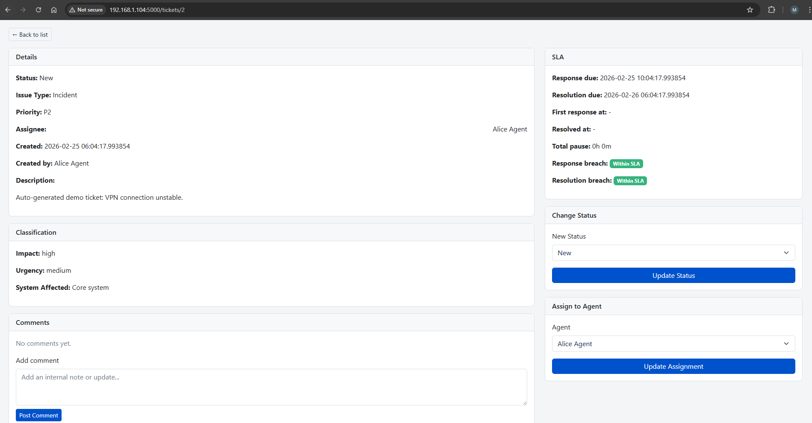
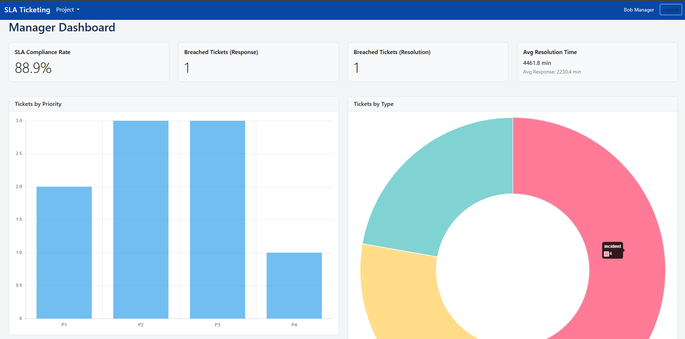

# sla-ticket-system
## overview
A prototype of a small IT Service Management (ITSM) support ticket system designed that I implemented using AI tools to demonstrate SLA tracking, ticket lifecycle management, and operational visibility for support teams.This project simulates how modern support platforms such as Jira, Zendesk, and ServiceNow manage incidents, service requests, priorities, and service level agreements (SLAs).
This project was built as a learning prototype as to simulate how a basic IT support ticketing system works and to gain practical experience implementing these concepts while gaining hands on experience integrating AI tools in application development and idea visualizing.

## problem
Support teams must manage large volumes of tickets while ensuring service level agreements (SLAs) are respected.
Without proper tracking, teams can:

- Miss response deadlines  
- Fail to resolve incidents on time  
- Lose visibility on support performance
  

## Solution

This project implements a simplified support ticket system with automated SLA tracking and role-based access for agents and managers.
Tickets are classified by type (Incident, Problem, Service Request), prioritized based on impact and urgency, and monitored against response and resolution targets.
Managers can track SLA performance using dashboards.

## Project Takeaways

- Using AI agents and vibe coding to develop applications that solve a problem
- understanding the architecture behind web applications from html files to github repositories 
- understanding how git works 
- Understanding ticket lifecycle in IT support
- Implementing SLA logic in software
- Working with Flask and SQLAlchemy
- Structuring backend applications

## Key Features

- Ticket creation with structured issue classification  
- Priority calculation using Impact/Urgency matrix  
- SLA response and resolution tracking  
- Role-based views (Agent / Manager)  
- Ticket assignment workflow  
- SLA breach detection  
- Manager KPI dashboard  

## System Roles

Agent

- View tickets  
- Take ownership of tickets  
- Update status  
- resolve issues  

Manager

- View all tickets  
- assign tickets to agents  
- monitor SLA performance  
- view support KPIs

## Tech Stack

Python  
Flask  
SQLite  
SQLAlchemy  
HTML / Jinja Templates
GitHub
AI-assisted development tools

## AI-Assisted Development

This prototype was developed using AI-assisted coding tools within Visual Studio Code.
The goal was to explore how AI tools can accelerate development workflows while still requiring the developer to understand system design, debugging, and implementation.
AI was used to:
- speed up development
- generate initial code structures
- assist with debugging
- improve productivity during prototyping

This project helped me gain hands-on experience integrating AI tools into a real development workflow.

## Application Architecture

The system follows a basic layered architecture:
Presentation Layer  
Flask routes and HTML templates handle the user interface.

Business Logic Layer  
Service modules handle ticket workflows, SLA calculations, and priority logic.

Data Layer  
SQLAlchemy models manage ticket data stored in a SQLite database.

## Ticket Workflow

Typical ticket lifecycle:

1. User creates a ticket
2. Priority is automatically calculated
3. SLA policy is applied
4. Support agent reviews the ticket
5. Ticket status is updated during resolution
6. Comments are added for communication
7. Ticket is resolved and closed

## Screenshots

### Ticket Creation

### Ticket overview

### Ticket details 

### Ticket Dashboard

  
## Future Improvements

- SLA escalation workflow  
- email notifications and breach alerts  
- role-based permission improvements  
- advanced analytics dashboards  
- integration with real helpdesk platforms 
- search feature
- ticket linking capability 
